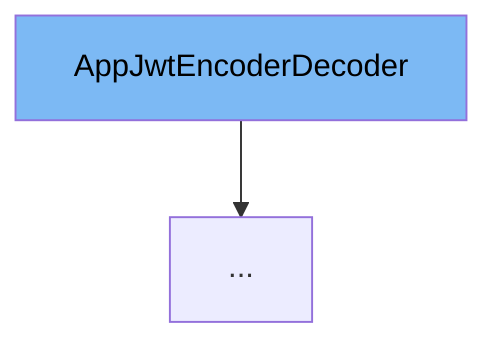

This document will cover the following topics about the `AppJwtEncoderDecoder` class:

1. What is `AppJwtEncoderDecoder`.
2. Variables and functions in `AppJwtEncoderDecoder`.
3. Usage example of `AppJwtEncoderDecoder`.



# What is AppJwtEncoderDecoder

`AppJwtEncoderDecoder` is an interface in the `com.myhome.security.jwt` package. It provides a contract for encoding and decoding the application's JWT (JSON Web Token).

<SwmSnippet path="/service/src/main/java/com/myhome/security/jwt/AppJwtEncoderDecoder.java" line="23">

---

# Variables and functions

The `decode` function is used to decode an encoded JWT using a secret. It takes two parameters: `encodedJwt` which is the JWT to be decoded, and `secret` which is the secret key used for decoding.

```java
  AppJwt decode(String encodedJwt, String secret);

  String encode(AppJwt jwt, String secret);
```

---

</SwmSnippet>

<SwmSnippet path="/service/src/main/java/com/myhome/security/jwt/AppJwtEncoderDecoder.java" line="25">

---

The `encode` function is used to encode a JWT using a secret. It takes two parameters: `jwt` which is the JWT to be encoded, and `secret` which is the secret key used for encoding.

```java
  String encode(AppJwt jwt, String secret);
```

---

</SwmSnippet>

<SwmSnippet path="/service/src/main/java/com/myhome/security/jwt/impl/NoSecretJwtEncoderDecoder.java" line="33">

---

# Usage example

`NoSecretJwtEncoderDecoder` is a concrete implementation of `AppJwtEncoderDecoder` interface. It overrides the `decode` and `encode` methods. The `decode` method splits the encoded JWT using a separator and builds an `AppJwt` object. The `encode` method concatenates the user ID and expiration of the JWT using the same separator.

```java
  @Override public AppJwt decode(String encodedJwt, String secret) {
    String[] strings = encodedJwt.split(SEPARATOR);
    return AppJwt.builder().userId(strings[0]).expiration(LocalDateTime.parse(strings[1])).build();
  }

  @Override public String encode(AppJwt jwt, String secret) {
    return jwt.getUserId() + SEPARATOR + jwt.getExpiration();
  }
```

---

</SwmSnippet>

&nbsp;

*This is an auto-generated document by Swimm AI 🌊 and has not yet been verified by a human*

<SwmMeta version="3.0.0" repo-id="Z2l0aHViJTNBJTNBREVNTy1NeUhvbWUlM0ElM0Fzd2ltbWlv" repo-name="DEMO-MyHome"><sup>Powered by [Swimm](/)</sup></SwmMeta>
