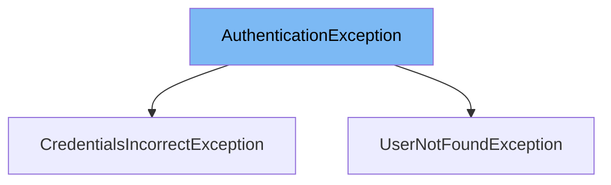

This document will cover the `AuthenticationException` class in the DEMO-MyHome project. We'll cover:

1. What is `AuthenticationException`
2. Variables and functions in `AuthenticationException`
3. Usage example of `AuthenticationException`



# What is AuthenticationException

`AuthenticationException` is a custom exception class in the DEMO-MyHome project. It extends `RuntimeException` and is used to handle authentication errors in the application. It is annotated with `@ResponseStatus(value = HttpStatus.UNAUTHORIZED)`, which means that whenever this exception is thrown, the server will respond with an HTTP status code of 401 (Unauthorized).

<SwmSnippet path="/service/src/main/java/com/myhome/controllers/exceptions/AuthenticationException.java" line="10">

---

# Variables and functions

The `ERROR_MESSAGE` variable is a constant string that stores the error message for this exception. It is set to 'Credentials are incorrect or user does not exists'.

```java
  private static final String ERROR_MESSAGE = "Credentials are incorrect or user does not exists";
```

---

</SwmSnippet>

<SwmSnippet path="/service/src/main/java/com/myhome/controllers/exceptions/AuthenticationException.java" line="11">

---

The `AuthenticationException` function is the constructor for this class. It calls the superclass constructor with the `ERROR_MESSAGE` as the argument, setting the message for this exception.

```java
  public AuthenticationException() {
    super(ERROR_MESSAGE);
  }
```

---

</SwmSnippet>

<SwmSnippet path="/service/src/main/java/com/myhome/controllers/exceptions/UserNotFoundException.java" line="6">

---

# Usage example

`UserNotFoundException` is an example of how `AuthenticationException` is used. `UserNotFoundException` extends `AuthenticationException`, meaning it inherits all its properties and behaviors. In the constructor of `UserNotFoundException`, it calls the `super()` method, which triggers the constructor of `AuthenticationException`, setting the error message to 'Credentials are incorrect or user does not exists'.

```java
public class UserNotFoundException extends AuthenticationException {
  public UserNotFoundException(String userEmail) {
    super();
    log.info("User not found - email: " + userEmail);
  }
```

---

</SwmSnippet>

&nbsp;

*This is an auto-generated document by Swimm AI 🌊 and has not yet been verified by a human*

<SwmMeta version="3.0.0" repo-id="Z2l0aHViJTNBJTNBREVNTy1NeUhvbWUlM0ElM0Fzd2ltbWlv" repo-name="DEMO-MyHome"><sup>Powered by [Swimm](/)</sup></SwmMeta>
