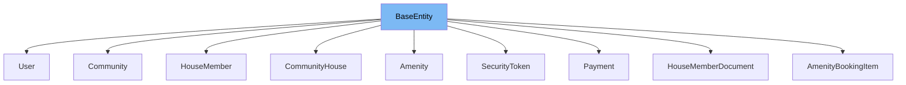

This document will cover the following aspects of the `BaseEntity` class:

1. What is `BaseEntity`.
2. Variables and functions in `BaseEntity`.
3. Usage example of `BaseEntity`.



# What is BaseEntity

`BaseEntity` is a base class for all JPA Entities in the project. It is designed to encapsulate common properties that all entities should have. In this case, it includes a unique identifier `id` for each entity. The class is marked with `@MappedSuperclass` annotation, indicating that it's not an entity itself, but its fields should be mapped to the database in the entities that extend it.

<SwmSnippet path="/service/src/main/java/com/myhome/domain/BaseEntity.java" line="40">

---

# Variables and functions

The `BaseEntity` class has a single variable `id`. This variable is annotated with `@Id` and `@GeneratedValue`, indicating that it's the primary key of the entity and its value is automatically generated by the database.

```java
  private Long id;
```

---

</SwmSnippet>

<SwmSnippet path="/service/src/main/java/com/myhome/domain/SecurityToken.java" line="20">

---

# Usage example

`BaseEntity` is extended by the `SecurityToken` class. This means that `SecurityToken` inherits the `id` field from `BaseEntity`. The `SecurityToken` class does not need to declare the `id` field itself, but it can use it as if it was declared in the `SecurityToken` class.

```java
public class SecurityToken extends BaseEntity {
  @Column(nullable = false)
  @Enumerated(EnumType.STRING)
  private SecurityTokenType tokenType;
  @Column(nullable = false, unique = true)
  private String token;
  @Column(nullable = false)
  private LocalDate creationDate;
  @Column(nullable = false)
  private LocalDate expiryDate;
  private boolean isUsed;
  @ManyToOne
  private User tokenOwner;
}
```

---

</SwmSnippet>

&nbsp;

*This is an auto-generated document by Swimm AI 🌊 and has not yet been verified by a human*

<SwmMeta version="3.0.0" repo-id="Z2l0aHViJTNBJTNBREVNTy1NeUhvbWUlM0ElM0Fzd2ltbWlv" repo-name="DEMO-MyHome"><sup>Powered by [Swimm](/)</sup></SwmMeta>
