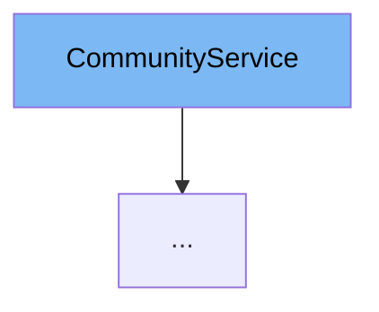

This document will cover the `CommunityService` class. We'll cover:

1. What is `CommunityService`.
2. `CommunityService`'s main variables and functions.
3. Example of how to use the `CommunityService` class.



# What is CommunityService

`CommunityService` is an interface in the `com.myhome.services` package. It provides a set of methods that are used to manage communities in the application. These methods include creating a community, listing all communities, getting community details, finding community houses and admins, adding admins and houses to a community, removing a house or an admin from a community, and deleting a community.

<SwmSnippet path="/service/src/main/java/com/myhome/services/CommunityService.java" line="29">

---

# Variables and functions

The function `createCommunity` is used to create a new community. It takes a `CommunityDto` object as a parameter and returns a `Community` object.

```java
  Community createCommunity(CommunityDto communityDto);
```

---

</SwmSnippet>

<SwmSnippet path="/service/src/main/java/com/myhome/services/CommunityService.java" line="31">

---

The function `listAll` is used to list all communities. It returns a set of `Community` objects.

```java
  Set<Community> listAll();
```

---

</SwmSnippet>

<SwmSnippet path="/service/src/main/java/com/myhome/services/CommunityService.java" line="33">

---

The function `listAll` is an overloaded version of the previous function. It takes a `Pageable` object as a parameter to support pagination and returns a set of `Community` objects.

```java
  Set<Community> listAll(Pageable pageable);
```

---

</SwmSnippet>

<SwmSnippet path="/service/src/main/java/com/myhome/services/CommunityService.java" line="35">

---

The function `getCommunityDetailsById` is used to get the details of a specific community by its ID. It returns an `Optional<Community>` object.

```java
  Optional<Community> getCommunityDetailsById(String communityId);
```

---

</SwmSnippet>

<SwmSnippet path="/service/src/main/java/com/myhome/services/CommunityService.java" line="37">

---

The function `findCommunityHousesById` is used to find all houses in a specific community by the community's ID. It returns an `Optional<List<CommunityHouse>>` object.

```java
  Optional<List<CommunityHouse>> findCommunityHousesById(String communityId, Pageable pageable);
```

---

</SwmSnippet>

<SwmSnippet path="/service/src/main/java/com/myhome/services/CommunityService.java" line="39">

---

The function `findCommunityAdminsById` is used to find all admins of a specific community by the community's ID. It returns an `Optional<List<User>>` object.

```java
  Optional<List<User>> findCommunityAdminsById(String communityId, Pageable pageable);
```

---

</SwmSnippet>

<SwmSnippet path="/service/src/main/java/com/myhome/services/CommunityService.java" line="41">

---

The function `findCommunityAdminById` is used to find a specific admin by their ID. It returns an `Optional<User>` object.

```java
  Optional<User> findCommunityAdminById(String adminId);
```

---

</SwmSnippet>

<SwmSnippet path="/service/src/main/java/com/myhome/services/CommunityService.java" line="43">

---

The function `getCommunityDetailsByIdWithAdmins` is used to get the details of a specific community along with its admins by the community's ID. It returns an `Optional<Community>` object.

```java
  Optional<Community> getCommunityDetailsByIdWithAdmins(String communityId);
```

---

</SwmSnippet>

<SwmSnippet path="/service/src/main/java/com/myhome/services/CommunityService.java" line="45">

---

The function `addAdminsToCommunity` is used to add admins to a specific community. It takes the community's ID and a set of admin IDs as parameters and returns an `Optional<Community>` object.

```java
  Optional<Community> addAdminsToCommunity(String communityId, Set<String> admins);
```

---

</SwmSnippet>

<SwmSnippet path="/service/src/main/java/com/myhome/services/CommunityService.java" line="47">

---

The function `addHousesToCommunity` is used to add houses to a specific community. It takes the community's ID and a set of `CommunityHouse` objects as parameters and returns a set of house IDs.

```java
  Set<String> addHousesToCommunity(String communityId, Set<CommunityHouse> houses);
```

---

</SwmSnippet>

<SwmSnippet path="/service/src/main/java/com/myhome/services/CommunityService.java" line="49">

---

The function `removeHouseFromCommunityByHouseId` is used to remove a house from a specific community by the house's ID. It takes a `Community` object and a house ID as parameters and returns a boolean indicating whether the operation was successful.

```java
  boolean removeHouseFromCommunityByHouseId(Community community, String houseId);
```

---

</SwmSnippet>

<SwmSnippet path="/service/src/main/java/com/myhome/services/CommunityService.java" line="51">

---

The function `deleteCommunity` is used to delete a specific community by its ID. It returns a boolean indicating whether the operation was successful.

```java
  boolean deleteCommunity(String communityId);
```

---

</SwmSnippet>

<SwmSnippet path="/service/src/main/java/com/myhome/services/CommunityService.java" line="53">

---

The function `removeAdminFromCommunity` is used to remove an admin from a specific community. It takes the community's ID and the admin's ID as parameters and returns a boolean indicating whether the operation was successful.

```java
  boolean removeAdminFromCommunity(String communityId, String adminId);
```

---

</SwmSnippet>

# Usage example

`CommunityService` is implemented by the `CommunitySDJpaService` class in the `com.myhome.services.springdatajpa` package. This class provides concrete implementations for all the methods declared in the `CommunityService` interface.

<SwmSnippet path="/service/src/main/java/com/myhome/services/springdatajpa/CommunitySDJpaService.java" line="54">

---

# Usage example

Here is an example of how the `createCommunity` method is implemented in the `CommunitySDJpaService` class. It generates a unique ID for the community, retrieves the user ID from the security context, adds the admin to the community, saves the community to the repository, and returns the saved community.

```java
  public Community createCommunity(CommunityDto communityDto) {
    communityDto.setCommunityId(generateUniqueId());
    String userId = (String) SecurityContextHolder.getContext().getAuthentication().getPrincipal();
    Community community = addAdminToCommunity(communityMapper.communityDtoToCommunity(communityDto),
        userId);
    Community savedCommunity = communityRepository.save(community);
    log.trace("saved community with id[{}] to repository", savedCommunity.getId());
    return savedCommunity;
```

---

</SwmSnippet>

&nbsp;

*This is an auto-generated document by Swimm AI 🌊 and has not yet been verified by a human*

<SwmMeta version="3.0.0" repo-id="Z2l0aHViJTNBJTNBREVNTy1NeUhvbWUlM0ElM0Fzd2ltbWlv" repo-name="DEMO-MyHome"><sup>Powered by [Swimm](/)</sup></SwmMeta>
