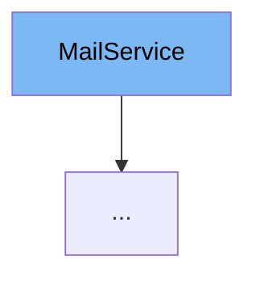

This document will cover the `MailService` class. We'll cover:

1. What is `MailService`
2. Variables and functions in `MailService`
3. Usage example of `MailService`



# What is MailService

`MailService` is an interface in the `com.myhome.services` package. It defines methods for sending different types of emails, such as password recovery, account creation, password change, and account confirmation.

<SwmSnippet path="/service/src/main/java/com/myhome/services/MailService.java" line="8">

---

# Variables and functions

The function `sendPasswordRecoverCode` is used to send a password recovery code to a user. It takes a `User` object and a `randomCode` as parameters.

```java
  boolean sendPasswordRecoverCode(User user, String randomCode);
```

---

</SwmSnippet>

<SwmSnippet path="/service/src/main/java/com/myhome/services/MailService.java" line="10">

---

The function `sendAccountCreated` is used to send an account creation confirmation to a user. It takes a `User` object and a `SecurityToken` object as parameters.

```java
  boolean sendAccountCreated(User user, SecurityToken emailConfirmToken);
```

---

</SwmSnippet>

<SwmSnippet path="/service/src/main/java/com/myhome/services/MailService.java" line="12">

---

The function `sendPasswordSuccessfullyChanged` is used to send a password change confirmation to a user. It takes a `User` object as a parameter.

```java
  boolean sendPasswordSuccessfullyChanged(User user);
```

---

</SwmSnippet>

<SwmSnippet path="/service/src/main/java/com/myhome/services/MailService.java" line="14">

---

The function `sendAccountConfirmed` is used to send an account confirmation to a user. It takes a `User` object as a parameter.

```java
  boolean sendAccountConfirmed(User user);
```

---

</SwmSnippet>

<SwmSnippet path="/service/src/main/java/com/myhome/services/springdatajpa/DevMailSDJpaService.java" line="14">

---

# Usage example

`DevMailSDJpaService` is an example of how `MailService` is used. It implements `MailService` and overrides its methods. Each method logs a message and returns true, simulating the sending of an email.

```java
public class DevMailSDJpaService implements MailService {

  @Override
  public boolean sendPasswordRecoverCode(User user, String randomCode) throws MailSendException {
    log.info(String.format("Password recover code sent to user with id= %s, code=%s", user.getUserId()), randomCode);
    return true;
  }

  @Override
  public boolean sendAccountConfirmed(User user) {
    log.info(String.format("Account confirmed message sent to user with id=%s", user.getUserId()));
    return true;
  }

  @Override
  public boolean sendPasswordSuccessfullyChanged(User user) {
    log.info(String.format("Password successfully changed message sent to user with id=%s", user.getUserId()));
    return true;
  }


```

---

</SwmSnippet>

&nbsp;

*This is an auto-generated document by Swimm AI 🌊 and has not yet been verified by a human*

<SwmMeta version="3.0.0" repo-id="Z2l0aHViJTNBJTNBREVNTy1NeUhvbWUlM0ElM0Fzd2ltbWlv" repo-name="DEMO-MyHome"><sup>Powered by [Swimm](/)</sup></SwmMeta>
